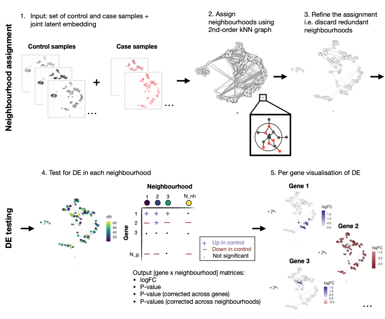

# miloDE
Framework for sensitive DE testing (using neighbourhoods).

miloDE builds on an existing framework for DA testing called [Milo](https://pubmed.ncbi.nlm.nih.gov/34594043/). 
It exploits the notion of overlapping neighborhoods of homogeneous cells, constructed from graph-representation of scRNA-seq data, and performs testing within each neighborhood. Multiple testing correction is performed either across neighborhoods or across genes. 

<p align="center">
  
</p>

In addition to DE testing, we provide functionality to rank neighbourhoods by degree of the DE as well as plotting functions to visualise results. In the vignette, we showcase how you can carry out clustering analysis to group genes in co-regulated transcriptional modules.


## Installation

```
# Install development version:
library(devtools)
devtools::install_github("MarioniLab/miloDE") 
library(miloDE)

*Note*: if you have troubles installing miloDE directly, try first to install miloR:
BiocManager::install('miloR')

## If you plan to use parallelisation (desired for big datasets), 
please load `BiocParallel` and enable milticore parallel evaluation:
library(BiocParallel)
ncores = MY_NCORES
mcparam = MulticoreParam(workers = ncores)
register(mcparam)


## Not an immediate functionality of miloDE, but we illustrate in our vignette how to adapt WGCNA 
approach to discover DE patterns and co-regulated gene modules. 
If you want to perform similar analysis, please install Seurat and scWGCNA:
install.packages('Seurat')
devtools::install_github("cferegrino/scWGCNA", ref="main")


```


## Pipeline

0. **Input**. The input of `miloDE` is scRNA-seq data, provided as `SingleCellExperiment` object. 
Additionally, we require that:

* Latent dimensions (used for graph construction) are pre-computed and stored in `reducedDim(sce)`.
* `colData(sce)` has to contain metadata corresponding assigning cells to individual replicates (passed to `sample_id`) and tested condition (e.g. healthy or disease, passed to `condition_id`).

You can explore toy data here:

```
data("sce_mouseEmbryo", package = "miloDE")
print(sce_mouseEmbryo)
# `pca.corrected` in reducedDim(sce) - PCs that we will use for graph construction

head(colData(sce_mouseEmbryo))
# `tomato` corresponds to condition id  
# `sample` corresponds to individual replicates. There are 2 samples per each condition:
table(colData(sce_mouseEmbryo)[,c('sample','tomato')])

```

1. **Neighbourhood assignment**: First step is to assign neighbourhoods using graph representation of scRNA-seq data'

```

sce_mouseEmbryo = assign_neighbourhoods(sce_mouseEmbryo, k = 20, order = 2, 
                                        filtering = TRUE, reducedDim_name = "pca.corrected")

```

2. **DE testing**: Once neighbourhoods are assigned, we can carry out DE testing. Output is returned in either `data.frame` or `SingleCellExperiment format`. For each tested gene-neighbourhood, we return `logFC`, `pvalue`, `pvalue corrected across genes` and `pvalue corrected across nhoods`. We also return boolean flag if test is performed.

```

de_stat = de_test_neighbourhoods(sce_mouseEmbryo , sample_id = "sample", 
                                 design = ~tomato, covariates = c("tomato"))


```


## Vignette

Please check the vignette to grasp additional functions aiding interpretation and analysis of miloDE output.

[Effect of Tal1 knock out on mouse development](https://rawcdn.githack.com/MarioniLab/miloDE_tutorials/d0b7b8abe05f157df2c3be2668aa4dccbc5f08de/miloDE__mouse_embryo.html). 


